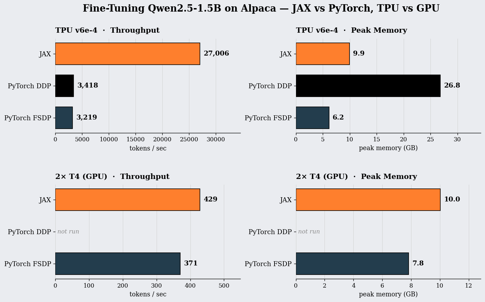
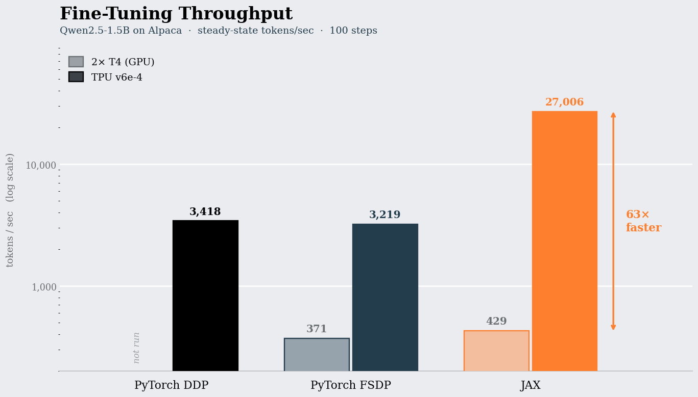
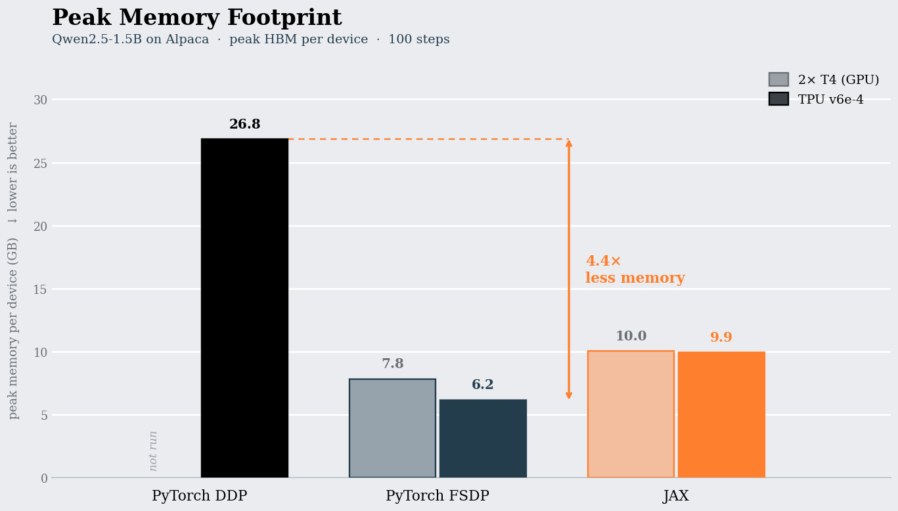
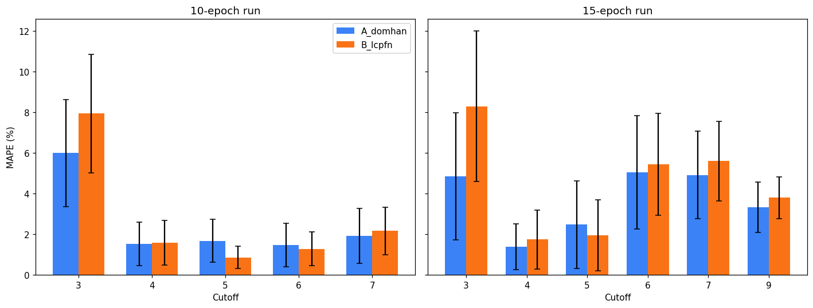
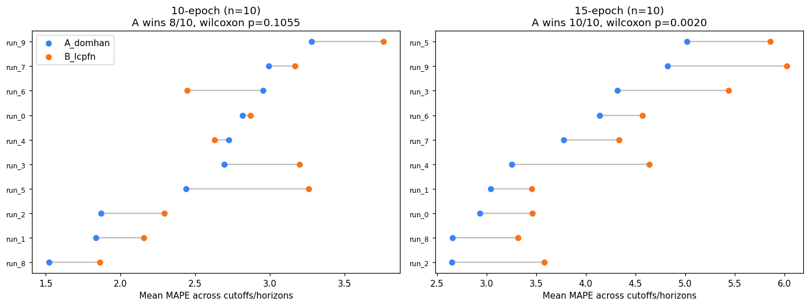

# Smartune

Upload your training data, and Smartune takes care of the rest. It scores
and filters your examples with an LLM before training even starts, picks
the right fine-tuning method for your model and hardware, and watches the
loss curve as it trains, warning you early if a run isn't going to pan
out instead of making you wait until the end to find out.

Under the hood: an LLM-scored curation rubric with duplicate filtering,
LoRA/QLoRA fine-tuning with automatic quantization decisions, and a live
forecasting engine that predicts the fine-tune's trajectory mid-run to
recommend stopping, continuing for more epochs, or flagging the run as
unlikely to succeed.

See `ARCHITECTURE.md` for the full product flow, design rationale, and
known findings from development (including two real bugs hit and fixed
during the build, see "Known Findings").

## Highlights

**Curation.** Claude scores and routes each example against a rubric,
flags near-duplicates, and produces an auditable kept/rejected report
with manual override support.

**Training.** LoRA/QLoRA fine-tuning with an automatic QLoRA decision
based on model size and available GPU memory.

**Forecasting.** Mid-run learning-curve extrapolation recommends
stop/continue/flag decisions before the run finishes.

**Full fine-tuning extension.** A from-scratch JAX/Flax reimplementation
of a Transformer (Qwen2) architecture, benchmarked against PyTorch
DDP/FSDP across GPU and Google Cloud TPU. JAX matched FSDP throughput on
GPU but ran about 8x faster than PyTorch on TPU (XLA-compiled: 27,006 vs.
3,418 tok/s DDP, 3,219 tok/s FSDP). FSDP-style sharding cut peak memory
about 4.4x versus DDP (26.8GB to 6.2GB on TPU). See `training/jax_v_pytorch/`.

**Forecasting-method comparison.** A controlled comparison of
learning-curve extrapolation methods (LC-PFN vs. a 2015 parametric
baseline vs. a fixed-budget null) on 10 real fine-tuning runs found an
apparent winner at n=150 disappeared at n=180. Forecast information
(epochs observed) mattered more than method choice. See
`notebooks/Forecasting_Feature_Research.ipynb`.

## Results

**JAX/Flax vs. PyTorch DDP/FSDP, Qwen2.5-1.5B fine-tuning, GPU vs. TPU**



| | 2x T4 (GPU) | TPU v6e-4 |
|---|---|---|
| PyTorch DDP | not run | 3,418 tok/s, 26.8GB |
| PyTorch FSDP | 371 tok/s, 7.8GB | 3,219 tok/s, 6.2GB |
| JAX (this work) | 429 tok/s, 10.0GB | **27,006 tok/s, 9.9GB** |

JAX is roughly on par with FSDP on GPU, but about 8x faster than either
PyTorch baseline on TPU once XLA compiles the training step. Running the
same JAX code on TPU instead of GPU is itself a 63x throughput jump.




**Forecasting-method comparison, LC-PFN vs. a 2015 parametric baseline**




With only 10 observed epochs, the parametric baseline (Domhan et al.,
2015) edges out LC-PFN on more runs than not (8/10), but the difference
isn't statistically significant (Wilcoxon p=0.11). Give the same methods
15 epochs of signal instead and the baseline wins on all 10 runs, now
significantly (p=0.002). The amount of training history observed moved
the result more than which forecasting method was used.

## Status

Core pipeline validated end-to-end in a Kaggle notebook (Qwen2.5-1.5B,
LoRA, 50-example Alpaca sample), and the dashboard version below is fully
wired to the same backend modules (curation, training, forecasting,
evaluation) rather than a mockup. See `dashboard/app.py`.

## Structure

`curation/` holds LLM-based dataset scoring, duplicate detection and
filtering, and schema auto-detection (`preprocess.py`) for raw uploads.

`training/` holds LoRA/QLoRA and full fine-tuning, the auto-QLoRA
decision (`finetune.py`), the forecasting engine and stop/continue
decision logic (`forecasting.py`, `decision_engine.py`), and the JAX/Flax
vs. PyTorch DDP/FSDP benchmark (`jax_v_pytorch/`).

`evaluation/` holds generation and LLM-as-judge comparison of
fine-tuned vs. base model outputs.

`dashboard/` holds the Streamlit UI wiring the above together
(`app.py` is the user-facing dashboard, `dev_dashboard.py` is a
developer harness that exercises each backend function in isolation).

`results/` holds exported reports, run configs, and benchmark results.

`notebooks/` holds exploratory research, including the forecasting-method
comparison and the JAX-vs-PyTorch analysis.

## Setup

```bash
pip install -r requirements.txt
cp .env.example .env  # add your ANTHROPIC_API_KEY
streamlit run dashboard/app.py
```

Fine-tuning needs a GPU (LoRA/QLoRA) or a GPU/TPU (full fine-tuning via
JAX). Without one, the dashboard's "Demo mode" simulates a training run
while still exercising the real forecasting/decision-engine logic.

## Validated Reference Run

50 examples (Stanford Alpaca), Haiku curation at threshold 6.7, 35 kept.
Qwen2.5-1.5B-Instruct, LoRA (r=8, q_proj/v_proj), 3 epochs, 170s, 4.73GB
peak memory. Fine-tuned model won 5/10 held-out comparisons vs. base
(Haiku-as-judge), 4 ties, 1 loss.

Full details in `ARCHITECTURE.md`.
